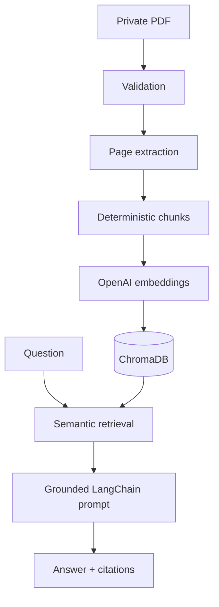

<div align="center">

# AegisRAG

### Secure, citation-grounded intelligence for private PDF reports

[](https://github.com/krishanth7/AegisRAG/actions/workflows/ci.yml)
[](https://github.com/krishanth7/AegisRAG/actions/workflows/security.yml)
[](https://www.python.org/)
[](LICENSE)

**LangChain · ChromaDB · FastAPI · OpenAI · Docker**

[Quick start](#quick-start) · [Architecture](#architecture) · [API](docs/api.md) · [Security](SECURITY.md) · [Contributing](CONTRIBUTING.md)

</div>

## Overview

AegisRAG is an enterprise-ready Retrieval-Augmented Generation platform for asking
questions across private PDF reports. It validates and extracts documents page by
page, creates traceable chunks, stores embeddings in ChromaDB, retrieves the most
relevant evidence, and returns concise answers with source citations.

The project is designed for auditability, operational clarity, and portfolio-quality
engineering—not as a black-box document chatbot.

## Why AegisRAG

- **Grounded answers** — generation is constrained to retrieved report evidence.
- **Auditable citations** — every answer includes filename, page, chunk ID, and excerpt.
- **Private deployment** — uploads and vector indexes stay on operator-controlled storage.
- **Defensive ingestion** — type, size, encryption, traversal, and collision safeguards.
- **Typed contracts** — Pydantic models stabilize API and service boundaries.
- **Production surface** — FastAPI, CLI, Docker, Compose, CI, CodeQL, tests, and governance.
- **Modular design** — loaders, embeddings, vector storage, retrieval, and generation are replaceable.

## Architecture



See [the architecture guide](docs/architecture.md) for boundaries and request lifecycles.

## Project structure

```text
AegisRAG/
├── src/aegisrag/
│   ├── api/                 # FastAPI routes and dependency wiring
│   ├── ingestion/           # PDF extraction and chunking
│   ├── services/            # Ingestion, retrieval, and QA orchestration
│   ├── cli.py               # Operator CLI
│   ├── config.py            # Typed environment settings
│   ├── models.py            # Stable domain contracts
│   ├── storage.py           # Safe upload allocation
│   └── vectorstore.py       # Chroma integration
├── tests/                   # Unit and API contract tests
├── docs/                    # Architecture, API, and operations
├── config/                  # Logging configuration
├── .github/                 # CI, security, templates
├── Dockerfile
├── compose.yaml
└── pyproject.toml
```

## Quick start

### 1. Install

```bash
git clone https://github.com/krishanth7/AegisRAG.git
cd AegisRAG
python -m venv .venv
source .venv/bin/activate
pip install -e ".[dev]"
```

On Windows PowerShell, activate with `.venv\Scripts\Activate.ps1`.

### 2. Configure

```bash
cp .env.example .env
```

Add your `OPENAI_API_KEY` to `.env`. Never commit the file.

### 3. Run

```bash
uvicorn aegisrag.api.app:app --reload
```

Open the interactive API documentation at `http://localhost:8000/docs`.

### 4. Ingest and query

```bash
aegisrag ingest ./reports/annual-report.pdf
aegisrag query "What operational risks are identified?"
```

Or use Docker:

```bash
docker compose up --build
```

## API examples

```bash
curl -X POST http://localhost:8000/v1/documents \
  -F "file=@private-report.pdf"

curl -X POST http://localhost:8000/v1/query \
  -H "Content-Type: application/json" \
  -d '{"question":"What are the principal operational risks?","top_k":5}'
```

A successful query returns:

```json
{
  "answer": "The report identifies supplier concentration as a primary risk.",
  "citations": [
    {
      "filename": "private-report.pdf",
      "page": 18,
      "chunk_id": "a12bc34d56ef7890-p18-c2",
      "excerpt": "Supplier concentration remains..."
    }
  ],
  "request_id": "2dd5cdb3-46f2-4d0d-862f-71a3e42df749"
}
```

## Quality and security

```bash
ruff check .
mypy src
pytest
```

CI runs linting, strict type checks, tests, and coverage across Python 3.11 and 3.12.
CodeQL performs scheduled and change-triggered security analysis. Review
[SECURITY.md](SECURITY.md) before deploying with sensitive information.

> AegisRAG provides secure engineering foundations, but operators remain responsible
> for authentication, encryption, retention, network controls, backups, access policy,
> and model-provider data-processing terms.

## Screenshots

The API ships with interactive OpenAPI documentation at `/docs`. Product UI
screenshots will be added when the optional web console reaches its first release.

| Experience | Status |
|---|---|
| Swagger/OpenAPI explorer | Available at runtime |
| CLI ingest and query | Available |
| Web console | Planned |

## Roadmap

- pluggable local and hosted embedding providers
- hybrid lexical and semantic retrieval
- reranking and retrieval evaluation
- tenant-aware authorization
- OCR for scanned reports
- document lifecycle and retention controls
- optional Streamlit administration console
- OpenTelemetry metrics and tracing

## Branching and commits

`main` is always releasable. Changes use short-lived `feature/*`, `fix/*`,
`test/*`, `docs/*`, or `chore/*` branches and focused pull requests.

Commit messages follow Conventional Commits: `feat:`, `fix:`, `docs:`, `test:`,
`refactor:`, `perf:`, `build:`, `ci:`, `chore:`, and `security:`.

## Contributing

Contributions are welcome. Read [CONTRIBUTING.md](CONTRIBUTING.md) and the
[Code of Conduct](CODE_OF_CONDUCT.md) before opening a pull request. Never attach
private reports or credentials to public issues.

## License

Released under the [MIT License](LICENSE).
