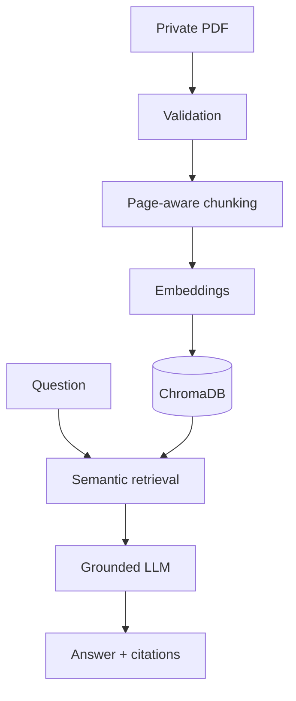

# Architecture

```mermaid
flowchart TD
    U[Private PDF] --> V[Validation]
    V --> C[Page-aware chunking]
    C --> E[Embeddings]
    E --> D[(ChromaDB)]
    Q[Question] --> R[Semantic retrieval]
    D --> R
    R --> L[Grounded LLM]
    L --> A[Answer + citations]
```

AegisRAG is grounded by default, traceable by page, private by operation, modular at
service boundaries, and fail-closed for unsupported uploads.
